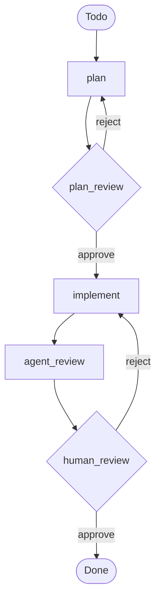

# Cadence

A Claude Code plugin that turns Linear into a multi-agent workflow runner.
Issues flow through a state machine you define; subagents do the work;
humans approve at gates; PRs land. No long-running daemon — each tick is
one shot, fired by `/schedule` or `/loop`.

Cadence is a reusable, packaged take on the multi-agent supervisor pattern,
inspired by the per-project
[Stokowski](https://github.com/Sugar-Coffee/stokowski) supervisor. Consuming
projects install the plugin, run `/cadence:init`, edit one YAML
file and three subagent prompts, point a scheduled routine at
`/cadence:tick`, and watch Linear.

---

## What it does

```
   /schedule or /loop fires on cron interval
        |
        v
   /cadence:tick (Cadence bootstrap)
        |
        +-- 1. Pick next eligible Linear issue
        +-- 2. Acquire soft lock (cadence-active label)
        +-- 3. Read current Linear state → workflow state
        +-- 4. For gates: read verdict labels (approve / rework / waiting)
        +-- 5. Invoke matching subagent in fresh context
        +-- 6. Post tracking comment, move Linear state, release lock
        +-- 7. Exit (next fire picks up the next issue, or continues this one)
```

Workflow state lives in Linear columns. There is no separate database,
no orchestrator process, no resume-from-checkpoint. State machine
behaviour is described in prose in `commands/tick.md` — that
prose IS the dispatch logic.

---

## Install

**Local checkout (development)** — `claude --plugin-dir /path/to/cadence` loads
the plugin into a session without a permanent install; useful while iterating
on the plugin itself.

**Persistent install (marketplace)** — this repo doubles as its own
single-plugin marketplace via [`.claude-plugin/marketplace.json`](./.claude-plugin/marketplace.json),
so it installs like any other plugin. From GitHub:

```
/plugin marketplace add BenGGolden/cadence
/plugin install cadence@cadence
```

Or from a local clone (no GitHub round-trip):

```
/plugin marketplace add /path/to/cadence
/plugin install cadence@cadence
```

This copies the plugin into `~/.claude/plugins/` — no `--plugin-dir` flag on
every launch. See the [plugin marketplaces docs][marketplaces] for managing and
updating marketplaces.

Once loaded, the six slash commands appear under the `cadence:` namespace:
`/cadence:tick`, `/cadence:init`, `/cadence:sweep`, `/cadence:status`,
`/cadence:create-ticket`, `/cadence:uninstall`.

[marketplaces]: https://code.claude.com/docs/en/plugin-marketplaces

---

## Consumer setup

Both invocation modes use the same plugin and the same `/cadence:tick`
command — they differ only in where the cron lives. You need: Claude Code with
plugin support, a Linear MCP server, a **GitHub repository bound** to the
session (the GitHub connector — used for `git push` and all PR operations; no
`gh` CLI, no `GH_TOKEN`), and a Linear board with one column per workflow
stage. The default workflow:



— which needs seven Linear columns (Todo, Planning, Plan Review,
Implementing, Reviewing, In Review, Done). Reshape via `workflow.yaml`.

Gates use **one column plus two labels**, not three columns. Create the
`cadence-approve` and `cadence-rework` labels in Linear alongside the
existing `cadence-active` / `cadence-needs-human` labels; a reviewer
signals their verdict on an issue sitting in the gate's waiting column
(`In Review` in the default workflow) by adding one of those labels.
**Recommended:** put both labels into a Linear label group (workspace
settings → Labels → New group) so the picker renders the verdict as a
single-select control instead of two independent toggles. Cadence treats
the dual-label case as rework as a defensive guard, but the group makes
it structurally unreachable from the UI.

### Mode A — Remote (`/schedule`)

Fully autonomous. No operator presence required between fires.

1. Install the plugin locally (see above). Cloud `/schedule` routines do
   **not** load Claude Code plugins — plugins are local-only. Cadence works
   around this by having `/cadence:init` copy the dispatch prose
   (`.claude/commands/cadence/{tick,sweep,status}.md`) and helper scripts
   (`.claude/cadence/hooks/*.py`) into the consumer repo, so the cloud session
   reads them as project-scoped slash commands. The local install only
   exists to run `/cadence:init` once and to drive `/loop` if you also
   want Mode B.
2. Run `/cadence:init` in the consuming repo's Claude Code session.
3. Edit the scaffolded files under `.claude/` — `workflow.yaml` (Linear team,
   project, state names), `agents/*.md` (model, tools, system prompt),
   `prompts/global.md` (shared preamble). Commit the whole `.claude/`
   directory — the cloud routine reads the dispatch prose, hooks, and
   `settings.json` from the checked-out repo.
4. **Make Linear's MCP server reachable from the routine.** Cloud routines do
   NOT inherit MCP servers added locally via `claude mcp add`. Either set up an
   account-level connector ([claude.ai/customize/connectors][connectors] →
   Linear → OAuth — recommended, since Linear's OAuth flow is web-only), or
   commit a `.mcp.json` at the consumer repo root. The same applies to any
   other MCP server the subagents need.
5. **Create a `/schedule` routine** ([claude.ai/code/routines][routines]):
   schedule `*/1 * * * *`, prompt `/cadence:tick`, Linear connector on, and a
   **GitHub repository bound** via the routine's repo picker (the GitHub
   Integration). That binding gives the routine both authenticated `git`
   (branch/commit/push) and the GitHub MCP tools (create/read/merge PRs) — no
   `GH_TOKEN`, no `GH_REPO`, no setup script. **Connector tools, including PR
   writes, are auto-allowed during a run** — you only need to set Linear MCP
   tools + `Agent` + `Bash` + `Read`/`Write`/`Edit` to Always Allow (an
   unattended routine hangs on any permission prompt). Bake expensive repo
   setup (npm install, native deps) into the cloud environment's setup script
   rather than rerunning it every fire.
6. **Create a second routine for stale-lock cleanup:** schedule `*/15 * * * *`,
   prompt `/cadence:sweep`, same connectors / env / permissions as the tick
   routine.
7. Watch Linear.

[connectors]: https://claude.ai/customize/connectors
[routines]: https://claude.ai/code/routines

#### GitHub PR operations

There is **no `gh` CLI setup** — no `apt install gh`, no `GH_TOKEN`, no
`GH_REPO`. Binding a GitHub repository to the routine (step 5) gives it
everything PR ops need:

- **`git`** (branch/commit/**push**), authenticated by the connector — the
  implementer subagent uses this and nothing else.
- **GitHub MCP** tools (`create_pull_request`, `list_pull_requests`,
  `get_pull_request`, `merge_pull_request`), used by the **bootstrap** — not
  the subagents. The bootstrap owns every PR operation: it creates the PR from
  the branch the implementer pushed (reusing the open PR on a rework run),
  and, for an opt-in `merge_on_approve` gate, reads PR state and merges. The
  connector's tools auto-allow their writes during a run, and they scope to
  the bound repo on their own (create needs no repo argument; read/merge take
  `owner`/`repo`/`number` from the PR URL) — so **no repo config** is added
  anywhere.

If `git push` itself fails (no connector, remote rejects), the implementer
bails cleanly rather than improvise — see the `## Short-circuits` section in
[templates/agents/cadence/cadence-implementer.md](./templates/agents/cadence/cadence-implementer.md).

### Ticket quality

Cadence treats every Linear issue as a contract — the
`## Acceptance Criteria` block is what the implementer builds against and
the reviewer checks. But a ticket no longer *needs* that block before it
can be planned. When the description lacks valid
`- [ ] **AC-N** — <specific outcome>` checkbox items, the planner subagent
**authors** the acceptance criteria as part of its plan, emitting them in a
`## Proposed Acceptance Criteria` section of its summary comment. If the
operator already wrote some AC, the planner augments — it proposes only the
gap items and never rewrites existing AC.

Those proposed criteria are the human's call at the `plan_review` gate. On
**approve**, the Cadence bootstrap promotes the planner's latest proposed AC
into the issue description's `## Acceptance Criteria` block (a deterministic,
idempotent merge — `templates/cadence/hooks/promote_acceptance_criteria.py`), *then*
the same fire proceeds to `implement`, so the implementer reads the
now-populated AC from the description. On **rework**, the description is
left untouched and the re-running planner re-proposes per the feedback.

To draft well-formed tickets faster *locally*, run `/cadence:create-ticket`
in your Claude Code session. It walks you through the template at
`.claude/ticket-template.md`, validates each AC against a vagueness
heuristic, and emits a paste-ready Markdown blob you drop into Linear's
"New Issue" form. The command does not touch Linear directly — keeping
local sessions free of any Linear MCP requirement — and does not invoke
any subagent. It's now an optional shortcut, not a precondition: a ticket
created from Linear's UI or imported from another tracker still gets
planned, with the planner supplying any missing AC for you to approve.

### Mode B — Local (`/loop`)

Operator-tended. Steps 1–3 are identical to Mode A. Then, from an interactive
Claude Code session in the repo, run `claude /loop 1m /cadence:tick` and leave
it running — Ctrl+C to pause. Your local Claude Code must have the **GitHub
connector / MCP configured** (the bootstrap creates and merges PRs through it;
there is no `gh` fallback) and the Linear MCP reachable.

No stale-lock sweeper needed — `/loop` has no platform timeout that could
strand a lock, and you can clear `cadence-active` manually in Linear if needed.

### Choosing a mode

|                          | Remote (`/schedule`)        | Local (`/loop`)                |
|--------------------------|-----------------------------|--------------------------------|
| Operator presence        | Not required                | Required                       |
| Subagent timeout ceiling | Platform max (~30 min)      | Effectively none               |
| Multi-operator safety    | Soft lock essential         | Soft lock essential if multi-op |
| Credentials              | Connectors on routine (Linear + bound GitHub repo) | Local Linear + GitHub MCP connectors |
| Debug loop               | Slow (remote logs)          | Fast (live terminal)           |
| Bus factor               | Higher                      | 1                              |

Teams that want CI-like "fire and forget" pick remote. Teams that want to
watch their fleet and keep work on a laptop pick local.

---

## Workflow tuning

### `max_in_flight` — per-state concurrency caps

Any `type: agent` or `type: gate` state in `.claude/workflow.yaml` can
declare an optional `max_in_flight: N` (positive integer). When set,
`/cadence:tick` counts the issues currently sitting in that state's
`linear_state` column on every fire and runs a **bounded reachability
walk** for each candidate at pickup time. The walk starts at the
candidate's effective target state, follows `next` through agent
states, and **stops at the first gate or terminal it reaches**
(inclusive — the gate is checked, then the walk ends). If any visited
state is at its cap, the candidate is skipped and the fire exits with
a `(caps reached for: …)` note. The cap is **coordination, not a
hard lock** — counts are recomputed from live Linear column
membership each fire, so manual moves between fires self-correct on
the next pickup.

**Why the walk stops at the first gate.** Every gate is a parking
spot for a distinct human's attention. A candidate that enters the
workflow only needs to pass through *its* next gate's queue — it'll
wait there for that gate's reviewer, and downstream gates are someone
else's bandwidth concern. Conflating them would mean an at-cap
`human_review` (one reviewer's queue) silently blocks new Todo pickups
that would have parked at `plan_review` (a different reviewer's queue
with capacity). The bounded walk gives each gate-owning reviewer their
own cap to set independently.

**Agent caps vs. gate caps** — they look the same in YAML but bind
differently:

- An **agent cap** throttles **parallel subagent runs** at the agent's
  own state. Useful for limiting how many planners or implementers
  fire in parallel.
- A **gate cap** throttles the gate's **waiting queue** by blocking
  candidates whose bounded walk reaches the gate. The bootstrap
  exempts verdict-bearing issues already sitting in the gate from
  their own gate's cap — acting on a verdict drains the queue, so
  the gate's own cap must not block the drain.

Worked example, default workflow (`plan → plan_review → implement →
agent_review → human_review → done`):

| Candidate state                  | Walk                                                | Caps that bind                              |
|----------------------------------|-----------------------------------------------------|---------------------------------------------|
| `Todo`                           | `plan → plan_review`                                | `plan`, `plan_review`                       |
| `Plan Review` + `cadence-approve` | `implement → agent_review → human_review`           | `implement`, `agent_review`, `human_review` |
| `Plan Review` + `cadence-rework` | `plan → plan_review` (`plan_review` drain-exempt)   | `plan`                                      |
| `In Review` + `cadence-approve`  | `done` (terminal)                                   | none                                        |
| `In Review` + `cadence-rework`   | `implement → agent_review → human_review` (`human_review` drain-exempt) | `implement`, `agent_review` |

Set caps where the bandwidth actually lives: cap each gate to the
depth its reviewer wants to triage; cap agent states (e.g.
`implement.max_in_flight`) when you want to throttle parallel runs of
that subagent specifically. Caps are forbidden on `type: terminal`
states (terminals have no pickup to throttle). The validator (Rule 6)
rejects that shape. `/cadence:status` surfaces current cap usage in
its Concurrency table when any state declares one — gates with caps
get a row alongside the agent states.

---

## Required permissions

Cadence is a system of slash commands and subagents — each call hits the
Claude Code permission system. In Mode A (`/schedule`) every tool the
bootstrap or a subagent calls **must be pre-allowed** on the routine,
because a remote routine has no human to answer permission prompts and
will hang or fail on the first prompt. In Mode B (`/loop`) you can
approve interactively, but pre-allowing the same set lets the loop run
unattended for stretches without stalling on prompts.

The lists below are the minimum surface for the shipped templates. If
you edit `.claude/agents/cadence/*.md` `tools:` lines or extend the bootstrap
prose, adjust accordingly.

### Bootstrap (`/cadence:tick`, `/cadence:sweep`, `/cadence:status`)

| Tool        | Why                                                          |
|-------------|--------------------------------------------------------------|
| `Read`      | Read `.claude/workflow.yaml`, `.claude/prompts/global.md`, subagent files. |
| `Bash`      | Generate the current UTC timestamp for tracking-comment JSON (`date -u …` or `Get-Date …`), and run the Python helper scripts under `.claude/cadence/hooks/` (config validation, comment parsing, tracking-comment emission). |
| GitHub MCP  | Create the PR after the implementer pushes (`create_pull_request` / `list_pull_requests`); for an opt-in `merge_on_approve` gate, read state + merge (`get_pull_request` / `merge_pull_request`). Auto-allowed by the bound GitHub connector — no allowlist entry needed. |
| `Agent`     | Invoke planner / implementer / reviewer subagents.           |
| `TodoWrite` | Optional — only if you want progress visibility on long fires. |

### Hooks (scaffolded into `.claude/cadence/hooks/` by `/cadence:init`)

`/cadence:init` writes two Claude Code hook scripts under `.claude/cadence/hooks/`
and merges the matching entries into `.claude/settings.json`:

| Hook                              | Event              | Why                                                                                                                       |
|-----------------------------------|--------------------|---------------------------------------------------------------------------------------------------------------------------|
| `validate_tracking_json.py`       | `PreToolUse`       | Blocks any Linear comment-create whose `<!-- cadence:* -->` tracking-comment JSON does not parse, before it reaches Linear. |
| `validate_workflow_on_prompt.py`  | `UserPromptSubmit` | Runs `validate_workflow.py` when a `/cadence:tick` prompt is submitted, blocking the run on a broken `.claude/workflow.yaml`. |

The hooks are scoped: each script no-ops immediately if
`.claude/workflow.yaml` is absent, so leaving them installed in a repo that
no longer uses Cadence does no harm.

### Subagents (shipped template defaults — edit per repo)

| Subagent       | Tools declared in frontmatter                         |
|----------------|-------------------------------------------------------|
| `cadence-planner`      | `Read, Grep, Glob, WebFetch, Bash`                    |
| `cadence-implementer`  | `Read, Edit, Write, Bash, Grep, Glob` (`Bash` covers `git`; the bootstrap, not the implementer, opens the PR) |
| `cadence-reviewer`     | `Read, Grep, Glob, WebFetch`                          |

### Linear MCP tools

Cadence makes a small, fixed set of Linear calls — three read-only (list
issues, read an issue, list comments) and two write (post a comment, update an
issue). Tool names vary by MCP vendor; match by intent.

**A note on namespaces.** Claude Code MCP tool names take the form
`mcp__<server-name>__<tool-name>`, where `<server-name>` is whatever the
operator passed to `claude mcp add` (or named in `.mcp.json`, or what the
claude.ai connector exposes). Three namespaces show up in the wild for
Linear:

- `mcp__linear__*` — the official Linear MCP server when installed under
  the name `linear`.
- `mcp__linear-server__*` — same server, installed under the name
  `linear-server` (common on Windows installs that follow Linear's docs).
- `mcp__claude_ai_Linear__*` — the claude.ai workspace connector.

Plus the bare names (`save_comment`, `get_issue`, etc.) some bridges
expose without an `mcp__<server>__` prefix.

The shipped Cadence hook matchers in `templates/settings.json`
catch all of these via the regex pattern
`mcp__[A-Za-z0-9_-]*[Ll]inear[A-Za-z0-9_-]*__<tool>` — any namespace
containing `linear` or `Linear`. **The Claude Code permission allowlist
does not.** Pre-allow rules are evaluated against exact tool names, so
the tables below are illustrative — substitute the names your specific
MCP server actually exposes. Check `claude mcp list` and look at the
permission prompt the first time a Cadence subagent tries to read or
write Linear.

> **`/cadence:init` automates this for local sessions.** Step 4
> detects your Linear MCP namespace and writes the canonical Cadence
> allowlist into `.claude/settings.local.json` so you don't have to
> paste it yourself. **Cloud `/schedule` routines do NOT read
> `.claude/settings.local.json`** — `/cadence:init`'s "Next steps"
> output also prints the same block under a "Permissions for /schedule
> routines" heading for you to paste into the routine's permissions
> panel.

**Read tools — pre-allow only what Cadence calls.**
The prose reaches for exactly three read-only tools. Set these to
Always Allow (using whichever namespace prefix your server exposes):

| Intent          | Example names — substitute your namespace                                                          |
|-----------------|----------------------------------------------------------------------------------------------------|
| List issues     | `list_issues`, `mcp__linear__list_issues`, `mcp__linear-server__list_issues`, `search_issues`      |
| Read an issue   | `get_issue`, `mcp__linear__get_issue`, `mcp__linear-server__get_issue`                             |
| List comments   | `list_comments`, `mcp__linear__list_comments`, `mcp__linear-server__list_comments`                 |

Leave the rest of the read-only category on Ask. "Read-only" is not
"harmless" — `get_document`, `list_users`, `list_projects`, etc. read
confidential data that has no business in a subagent's context, and a
hallucinated call could echo it into a comment the bootstrap posts verbatim.
Bulk-allowing the whole category is fine in a throwaway test workspace; on any
workspace with real data, pre-allow narrowly.

**Write tools — pre-allow only what Cadence calls.**
Set these to Always Allow (using whichever namespace prefix your server
exposes):

| Intent                       | Example names — substitute your namespace                                                                                          |
|------------------------------|------------------------------------------------------------------------------------------------------------------------------------|
| Post a comment               | `save_comment`, `mcp__linear__create_comment`, `mcp__linear-server__save_comment`                                                  |
| Update issue (state, labels) | `save_issue`, `mcp__linear__update_issue`, `mcp__linear-server__save_issue`, `mcp__linear__add_label`, `mcp__linear__remove_label` |

If your MCP server uses a namespace whose prefix does **not** contain
"linear" (case-insensitive), you also need to extend the matcher regex in
`.claude/settings.json` so the Cadence hooks see those tool calls — the
shipped regex assumes `linear` appears somewhere in the server name.

Leave every other write/delete tool on Ask (or off) — `create_attachment`,
`delete_comment`, `create_issue_label` (labels are created up front during
setup, not by the plugin), `save_document`, `save_project`, and any other
workspace-wide mutation. Keeping these on Ask means a hallucinated call or
future prose change fails closed instead of silently mutating Linear.

### Environment variables

**None.** Cadence sets no environment variables — no `GH_TOKEN`, no `GH_REPO`.
PR operations run via the GitHub connector's MCP tools and `git` push, both
authenticated by the **bound GitHub repository**, so there is no token or repo
variable to set in either mode.

---

## Watching the workflow

Once the routines are running, the human-facing view is `/cadence:status`.
It's read-only and safe to run any time:

```
$ claude /cadence:status
```

Sample output for a small workflow with several live issues:

```markdown
## Cadence status — 2026-05-11T14:23:01Z

Team: **ENG**   Project: **acme-platform**   Pickup: **Todo**

### Issues in workflow

| ID      | Title                                              | Linear column | Workflow state          | Attempt | Lock | Needs human | Verdict          |
|---------|----------------------------------------------------|---------------|-------------------------|---------|------|-------------|------------------|
| ENG-204 | Add OAuth callback retry on transient 5xx          | Implementing  | implement               | 2       | 🔒   |             |                  |
| ENG-198 | Migrate analytics worker to BullMQ                 | In Review     | human_review (waiting)  | 1       |      |             |                  |
| ENG-187 | Crash on empty rate-limit header                   | In Review     | human_review (waiting)  | 2       |      |             | cadence-rework   |
| ENG-176 | Tighten auth middleware regex                      | Todo          | (pickup)                | —       |      |             |                  |
| ENG-149 | Reindex legacy events                              | Implementing  | implement               | 3       |      | 🛑          |                  |

### Per-state counts

- **(pickup)** (`Todo`) — 1 issues
- **plan** (`Planning`) — 0 issues
- **plan_review** (gate, `Plan Review`) — 0 issues
- **implement** (`Implementing`) — 2 issues   🔒 1 locked   🛑 1 needs-human
- **agent_review** (`Reviewing`) — 0 issues
- **human_review** (gate, `In Review`) — 2 issues
  - awaiting verdict — 1 issues
  - 👎 cadence-rework — 1 issues
- **done** (`Done`) — 0 issues

Read-only — no Linear writes performed.
```

The **Verdict** column shows which gate-verdict label (if any) is queued
on each gate-waiting row. ENG-187 above will be routed back to
`implement` on the next `/cadence:tick` fire; the bootstrap will then
remove the label.

The lock (🔒) and needs-human (🛑) columns are the operational signals.
A lock means a tick is in flight (or a stale lock the sweeper hasn't
caught yet). Needs-human means the issue hit the attempt cap or rework
cap and is now sidelined until a human removes the
`cadence-needs-human` label. The Verdict column is the gate signal —
a value there means a reviewer has decided and the next fire will
route the issue accordingly.

---

## Troubleshooting

### Stale locks (Mode A)

**Symptom:** an issue keeps the `cadence-active` label but no fire is acting on
it; `/cadence:status` shows 🔒 with an `updatedAt` older than the tick interval.
**Cause:** a `/cadence:tick` fire was killed mid-tick (platform timeout, network
drop) before removing its own label.
**Fix:** the `/cadence:sweep` routine clears these on its cadence. For an
immediate clear, run `/cadence:sweep` once or delete the label in Linear. The
threshold is `limits.stale_after_minutes` in `workflow.yaml` (default 30).

### Max attempts reached

**Symptom:** an issue is sidelined with `cadence-needs-human`; comments include
`[Cadence] Max attempts (N) reached at state X`.
**Cause:** the same workflow state failed `limits.max_attempts_per_issue` times
in a row (default 3); the bootstrap stopped auto-retrying.
**Fix:** read the failure records (`<!-- cadence:state {"status":"failed",...} -->`)
to find the root cause — missing credentials, impossible task, flaky test,
ambiguous description — address it, then remove `cadence-needs-human`. The
attempt counter is **not** reset by label removal; delete the prior
attempt-marker comments for a clean slate. To abandon an issue permanently,
move it to a column outside the workflow and leave the label set.

### Rework limit reached

**Symptom:** like max attempts, but the failure comment names a gate:
`[Cadence] Rework limit reached at gate <name>`.
**Cause:** the gate's `max_rework` was exceeded.
**Fix:** same shape as max attempts — read the rework comments, fix the
underlying problem (often a clearer review comment or smaller scope), remove
`cadence-needs-human`. Delete prior `<!-- cadence:gate {"status":"rework"} -->`
comments to reset the counter.

### Validation errors

**Symptom:** every `/cadence:tick` fire exits immediately with a config error;
no Linear writes happen.
**Cause:** `.claude/workflow.yaml` violates a validation rule (duplicate column,
undefined target, missing subagent file).
**Fix:** the error names the offending keys — fix the YAML. Run
`/cadence:tick --dry-run` to confirm before going live again.

### Issue moved to an unmapped state

**Symptom:** a comment reads `Issue moved to unmapped Linear state <X> between
pickup and dispatch; releasing lock without action`, and the issue is
repeatedly picked up and released.
**Cause:** something moved the issue to a Linear column not in
`workflowLinearStates`.
**Fix:** move it back to a workflow column, add the column to `workflow.yaml`,
or remove its `cadence-active` label and accept it's out of band.

### Drift reconciliation

**Symptom:** a `<!-- cadence:reconcile ... -->` comment reads `Detected
human-driven state change; proceeding from Linear's state.`
**Cause:** a human dragged the issue between columns out of band; the bootstrap
detected the drift and is proceeding from Linear's authoritative state.
**Fix:** usually none — this is expected. If unintended, move it back and the
next fire re-reconciles.

### `/cadence:status` is slow

**Symptom:** status takes tens of seconds to render.
**Cause:** each issue's comment list is fetched separately to find its latest
attempt marker; large workflows amplify this.
**Fix:** the reporter degrades gracefully — it renders attempt counts as `?` on
fetch failure. To keep the table fast, narrow the project scope or run it
against a Linear filter view.

---

## Architecture in one glance

- **Linear state is the workflow state** — 1:1, no aliasing. The bootstrap
  reads Linear every fire to learn the current state.
- **Soft lock = a label** (`cadence-active`) — added at lock acquisition,
  removed at end of fire, stale ones swept on a separate cadence.
- **One issue per fire** — concurrency comes from cron frequency or parallel
  sessions, not intra-fire fan-out.
- **Subagents are stateless and Linear-blind** — the bootstrap is the sole
  Linear writer; subagents read code, make changes, open PRs, and return a
  Markdown string the bootstrap posts verbatim.
- **Plugin owns logic, consumer owns config** — the plugin ships the bootstrap
  prose, sweep / status logic, and subagent templates; the consumer owns
  everything under `.claude/`.

See [GUIDEPOSTS.md](./GUIDEPOSTS.md) for why the system is shaped this way.

---

## Files this plugin scaffolds

`/cadence:init` creates the following in the consumer's repo:

```
<consumer-repo>/
└── .claude/
    ├── workflow.yaml             # state machine config — edit me
    ├── ticket-template.md        # Cadence ticket skeleton — paste into Linear
    ├── prompts/
    │   └── global.md             # shared subagent preamble — edit me
    ├── agents/
    │   └── cadence/              # edit subagent prompts here (namespaced to avoid collisions)
    │       ├── cadence-planner.md       # Opus, read-only
    │       ├── cadence-implementer.md   # Sonnet, full edit + git push
    │       └── cadence-reviewer.md      # Opus, adversarial, read + git diff
    ├── commands/cadence/         # dispatch prose — committed so /schedule cloud routines can find it
    │   ├── tick.md
    │   ├── sweep.md
    │   └── status.md
    ├── cadence/
    │   └── hooks/                # plugin-owned Python helpers — copied from the plugin
    │       ├── validate_tracking_json.py     # PreToolUse event hook
    │       ├── validate_workflow_on_prompt.py # UserPromptSubmit event hook
    │       ├── validate_workflow.py
    │       ├── _common.py
    │       ├── parse_comments.py
    │       ├── promote_acceptance_criteria.py
    │       ├── emit_tracking_comment.py
    │       ├── classify_drift.py
    │       ├── classify_gate.py
    │       ├── route_fire.py
    │       ├── compose_lifecycle_context.py
    │       ├── filter_candidates.py
    │       ├── render_status_report.py
    │       └── render_sweep_report.py
    ├── worktrees/
    │   └── .gitignore            # ignores runtime subagent worktrees from the main checkout
    ├── settings.json             # hook entries merged in
    └── settings.local.json       # Linear MCP permissions allowlist merged in (per-operator, gitignored)
```

The top three (`workflow.yaml`, `prompts/global.md`, `agents/cadence/*.md`)
are the operator-facing surface. The rest is infrastructure — re-copied
verbatim on `/cadence:init --force`.

Re-running `/cadence:init` without `--force` refuses to overwrite. Use
`/cadence:init --force` to replace existing files.

To reverse all of the above, see [Uninstalling Cadence](#uninstalling-cadence).

---

## Uninstalling Cadence

`/cadence:uninstall` reverses `/cadence:init`. It deletes the plugin-owned
files it scaffolded (hooks, the `/cadence:*` commands, `worktrees/.gitignore`),
unmerges Cadence's hook entries from `.claude/settings.json` and the Linear-MCP
allowlist from `.claude/settings.local.json`, and removes the `.cadence/`
runtime scratch dir. Empty Cadence-created directories are pruned; `.claude/`
itself is never removed.

```
/cadence:uninstall --dry-run    # preview everything; change nothing
/cadence:uninstall              # remove plugin-owned files; keep your edited config
/cadence:uninstall --force      # also remove the user-config files you edit
```

- **User-config files** (`workflow.yaml`, `prompts/global.md`,
  `agents/cadence/*.md`, `ticket-template.md`) are **left in place by default** and
  listed in the summary — you likely edited and committed them. Pass
  `--force` to remove them too.
- A settings file is **deleted only if unmerging Cadence reduces it to `{}`**
  (it was effectively Cadence-only). A file that still holds non-Cadence
  entries is rewritten with just the Cadence entries stripped. An empty
  `{}` settings file you kept intentionally would be removed — that is by
  design (an empty settings file is a no-op).
- **`.claude/worktrees/`** is removed only when empty, so a live subagent
  worktree keeps it alive and it is listed as left-behind rather than nuked.
- Removal is **hard delete** — git history is the recovery path. Run
  `--dry-run` first.
- The **Linear side** (the `cadence-*` labels and the workflow columns) is a
  printed manual checklist, never an automated change: the plugin manages
  files, you manage Linear, on uninstall as on install.

`/cadence:uninstall` is a local-only command — unlike `/cadence:tick`, it is
not scaffolded for `/schedule` routines to call.

---

## Non-goals

- A long-running daemon. Each fire is one shot.
- Live TUI / web dashboard. Linear + GitHub are the UIs.
- Intra-fire parallelism. Concurrency comes from cron cadence + soft
  lock.
- Session resume across fires. Each fire reconstructs context from
  Linear directly.

---

## License

MIT. See [LICENSE](./LICENSE) if present.
