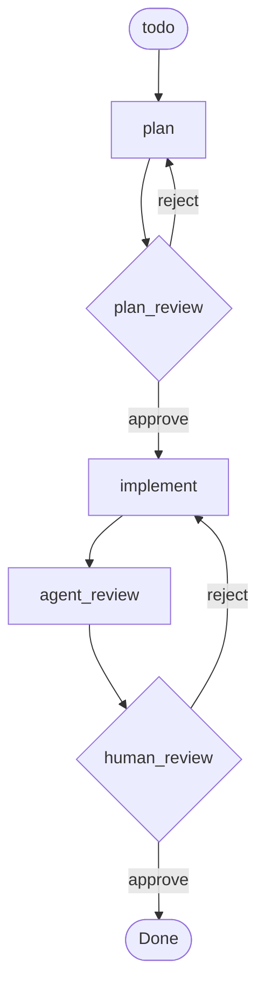

```mermaid
flowchart TD
    todo([todo]) --> plan
    plan --> plan_review{plan_review}
    plan_review -->|approve| implement
    plan_review -->|reject| plan
    implement --> agent_review
    agent_review --> human_review{human_review}
    human_review -->|approve| done([Done])
    human_review -->|reject| implement
```